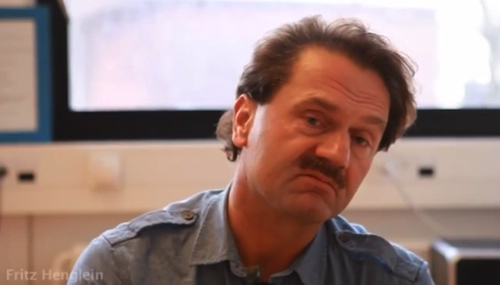



  
  <h1>Welcome to HIPERFIT!</h1>

    
HIPERFIT is a joint research center attempting to solve the
       simultaneous challenges of high transparency, high
       computational performance and high productivity in an
       integrated approach of declarative domain specific and
       high-level functional programming languages.

    
<a href="about.html" class="btn btn-primary btn-large">Learn more &raquo;</a>

  

    <h4>The Research Setup</h4>
    
HIPERFIT is an acronym for High Performance Computing in Financial IT.
    The center gathers research in different communities: mathematical finance,
programming languages, high-performance systems, and application
experts from the financial sector.
    

    
<a class="btn btn-primary" href="research.html">Research &raquo;</a>

  

  

    <h4>Hosted by KU</h4>
    
The HIPERFIT research center is hosted by the <a href="http://www.ku.dk/english">University of Copenhagen</a> and includes a number of <a href="partners.html">funding partners</a>
    from the Danish financial industry. The center is open for new
    collaborators from industry and commerce.

    
<a class="btn btn-primary" href="about.html">Read more &raquo;</a>

  

  

    <h4>Workshops</h4>
    
The HIPERFIT Research Center holds biannual workshops to foster
interdisciplinary cooperation and attract researchers and
practicioners for future cooperation. 

    
<a class="btn btn-primary" href="workshops.html">View details &raquo;</a>

  

  

    <h4>Student Projects</h4>
    
We are continuously looking for students interested in student projects within the research areas of HIPERFIT. If you are interested in a student project, please look at suggested student projects and talk to project members for more information.
    

    
<a class="btn btn-primary" href="studentprojects.html">Student Projects &raquo;</a>

  

  

    <h4>HIPERFIT The Movie (in danish)</h4>
    

  

