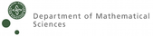
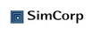



The research center has the following academic and private-sector
partners:

<table border="0" cellspacing="10" cellpadding="20">
<tbody>
<tr>
<td></td>
<td></td>
<td></td>
</tr>
<tr>
<td></td>
<td></td>
<td></td>
</tr>
<tr>
<td></td>
<td></td>
<td></td>
</tr>
</tbody>
</table>

 

The establishment of HIPERFIT has been encouraged, facilitated and
supported by the [Copenhagen Finance IT Region](http://www.cfir.dk)
(CFIR), which will serve as the center's liaison with the Danish
Bankers Association.

The research center welcomes additional partners. Please contact the
center for enquiries.