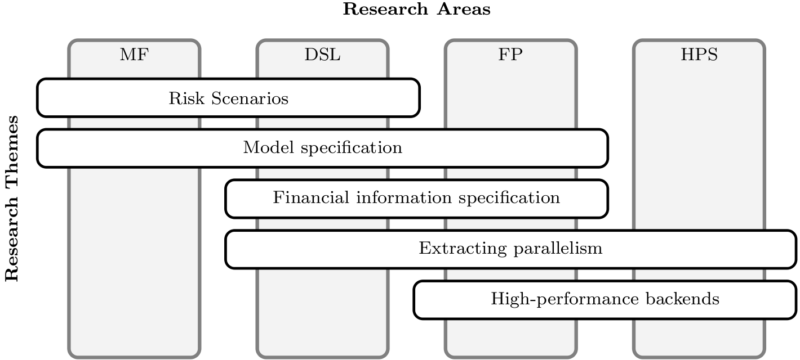



Research in HIPERFIT follows a paradigm of **project-driven research
theme exploration**.

**Projects** are concrete cases for exploration and development,
either motivated by practical needs of industry partners
(**problem-driven**), or by the intent to evaluate novel technologies
and gather know-how for later use (**technology driven**). Projects
may or may not contain information protected by industry
partners.

Experience and lessons from our work on projects directs our work on
[research themes](researchthemes.html), cross-cutting several research
areas within computing for finance, generally leading to open
publishable results. Projects help identify useful and timely goals,
while research themes provide the headroom and freedom which is
necessary for true innovation.

## Research Areas

### Mathematical Finance

TODO

### Domain-Specific Languages

Declarative domain-specific languages (DSLs) capture knowledge of
application experts in tailor-made constructs and thereby offer great
programing comfort, operating at a high level of (programming)
abstraction. DSLs are so widespread and successful in practice that it
is easy to overlook them. Examples of DSLs in use are: query languages
for relational database systems; spreadsheets involving circular
dependencies and incremental recomputation; or regular expression and
context-free grammars used in compiler construction tools.

Financial applications have been identified as a promising DSL area
relatively early. Researchers have successfully modelled and analysed
financial instruments , commercial contracts, and risk management
using DSL technology. DSLs for financial instruments are today
commonly used in many companies, but often mix contract and valuation
aspects. A crucial goal of HIPERFIT is to design similarly expressive
languages to describe the valuation process (possibly using
probabilistic computation and simulation), and to achieve clear
separation and interfaces towards a universal valuation
engine.

### Parallel Functional Programming

It has been stated numerous times that (parallel) functional
programming has fundamental advantages over an imperative programming
model (see the seminal paper by John Hughes and the book by Hammond
and Michaelson).  Functional programs are much easier to read and
understand, program construction and code reuse are simplified (glue),
and programs are transformed, optimised and formally reasoned about
with ease. More specific to parallel computations, absence of side
effects makes data dependencies and inherent parallelism manifest,
(purely) functional parallel programs are deterministic irrespective
of the evaluation order, and reduction semantics is inherently
parallel, to start with. Last but not least, higher-order functions
can nicely describe common parallelisation patterns as skeletons,
without getting lost in technical details or particularities of the
concrete algorithm. In all, irrespective of the concrete programming
model, the high abstraction provided by functional languages makes
them suitable languages to conceptually describe parallelism, in an
executable specification.

Within HIPERFIT, we aim to develop a functional language that can be
productively used to express computations in mathematical finance, and
which exposes inherent parallelism in these computations. Driven by
the concrete application domain of financial modeling, we will
identify common computation patterns and their potential for
parallelisation. Potentially parallel computations should be easy to
extract and transform into explicitly parallel operations on a variety
of modern parallel platforms.

### High-Performance Systems

TODO
